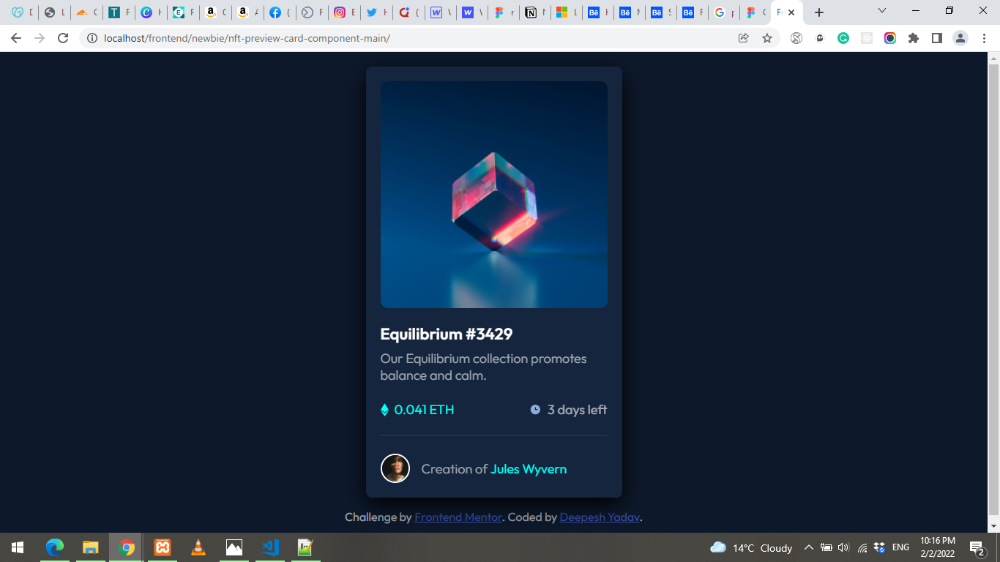
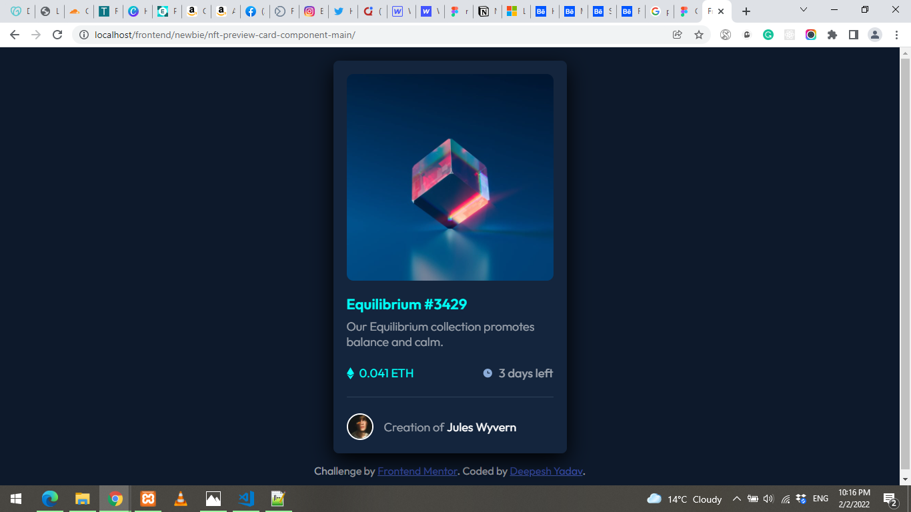
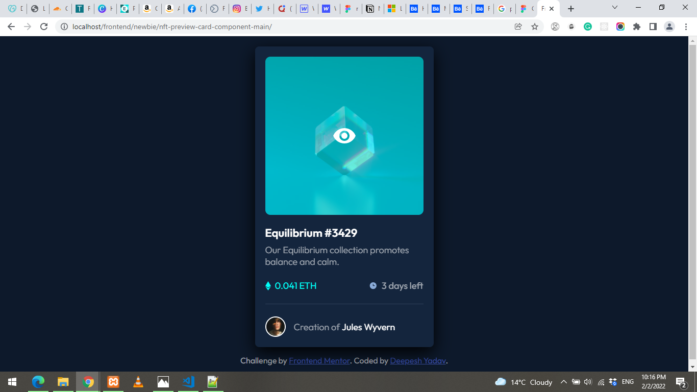
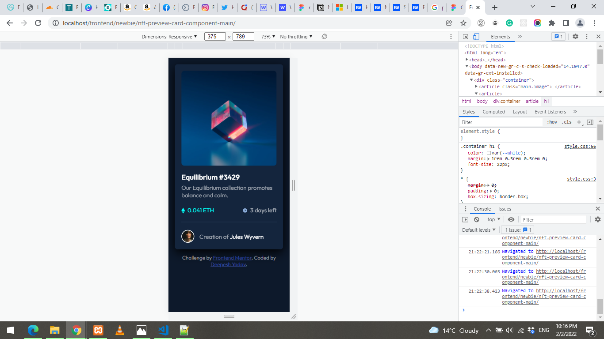

# Frontend Mentor - NFT preview card component solution


## Welcome! 👋

This is a solution to the [NFT preview card component challenge on Frontend Mentor](https://www.frontendmentor.io/challenges/nft-preview-card-component-SbdUL_w0U). Frontend Mentor challenges help you improve your coding skills by building realistic projects.

## Table of contents

- [Overview](#overview)
  - [The challenge](#the-challenge)
  - [Screenshot](#screenshot)
  - [Links](#links)
- [My process](#my-process)
  - [Built with](#built-with)
  - [What I learned](#what-i-learned)
  - [Continued development](#continued-development)
  - [Useful resources](#useful-resources)
- [Author](#author)
- [Acknowledgments](#acknowledgments)

**Note: Delete this note and update the table of contents based on what sections you keep.**

## Overview

### The challenge

The challenge is to build out this nft preview card component and get it looking as close to the design as possible.

Users should be able to:

- View the optimal layout depending on their device's screen size
- See hover states for interactive elements

### Screenshot






### Links

- Solution URL: [Codepen solution](https://codepen.io/deepeshyadav/pen/WNXxNYY)
- Live Site URL: [Github pages Live](https://deepeshyadavrd.github.io/nft-card-component/)

## My process

### Built with

- Semantic HTML5 markup
- CSS custom properties
- Flexbox
- CSS Grid
- Mobile-first workflow

### What I learned

```html
<h1>Some HTML code I'm proud of</h1>
```

```css
.container .main-image div {
  position: absolute;
  top: 0;
  background-color: hsl(178, 100%, 50%, 60%);
  width: 100%;
  height: calc(100% - 5px);
  z-index: 999;
  opacity: 0;
  transition: opacity 0.3s ease-in-out;
  border-radius: 10px;
}
```

### Continued development

Want to practice more mobile first workflow and responsive web develpment. Learning flexbox and grid to design my layout for a web-page.

## Author

- Website - [Deepesh Yadav](https://deepeshyadavrd.carrd.co)
- Frontend Mentor - [@deepeshyadavrd](https://www.frontendmentor.io/profile/deepeshyadavrd)
- Twitter - [@mrbigtech](https://www.twitter.com/mrbigtech)
- Codepen - [@deepeshyadav](https://codepen.io/deepeshyadav)

## Acknowledgments

I want to thank [tsbsankara](https://www.youtube.com/channel/UCeDWS6WbftXe9-6QQFMrKAQ), watched his video for hover effect on main image code.
